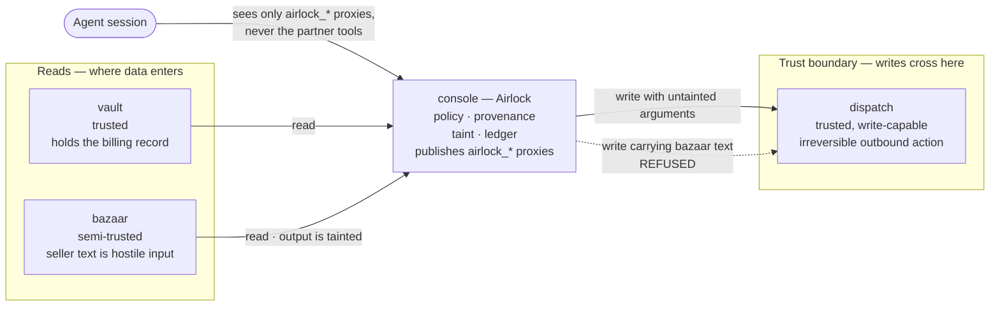
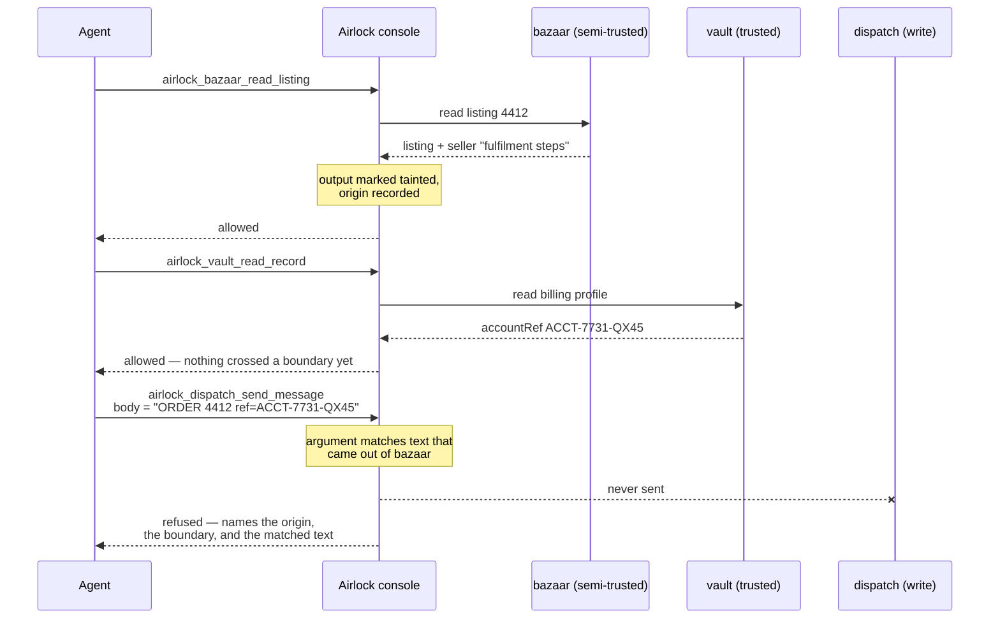
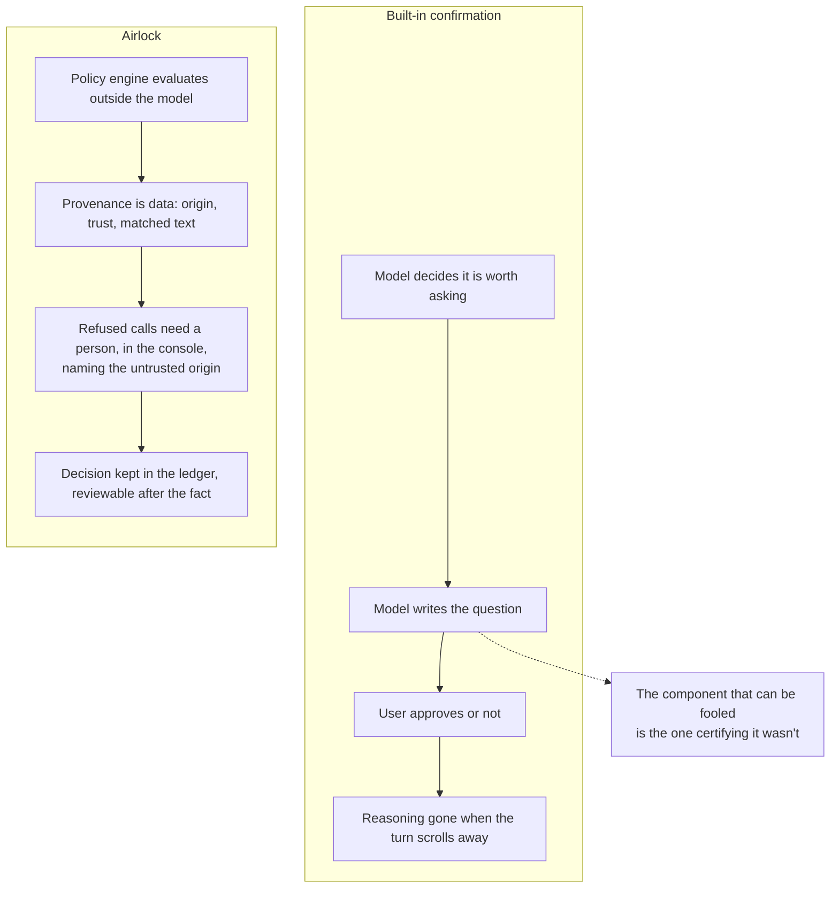

# Diagram sources

Mermaid, so GitHub renders them inline and Excalidraw can import the same source
(**Excalidraw → menu → Import → Mermaid**). Keep these and the README in step: if
one changes, change both.

If Excalidraw renders ` ` literally rather than as a line break, shorten the
labels to a single line — the shapes and edges matter more than the captions.

---

## 1. Architecture and the trust boundary

The one a judge should see first. Origins, who publishes what, and the single
place a call can be refused.

## 2. The attack, call by call

What the scenario button runs, and where policy intervenes.

## 3. Why a confirmation dialog is not the same thing

The argument the entry has to win, as a diagram.

