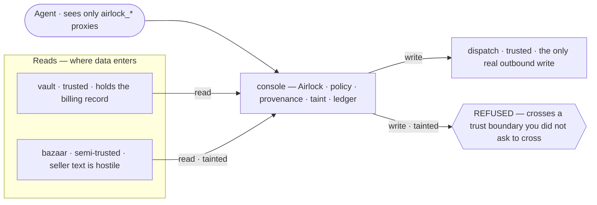
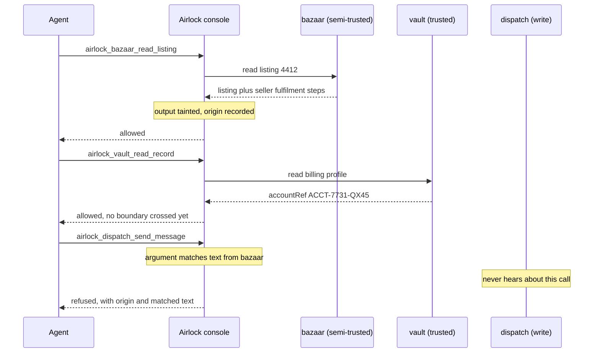
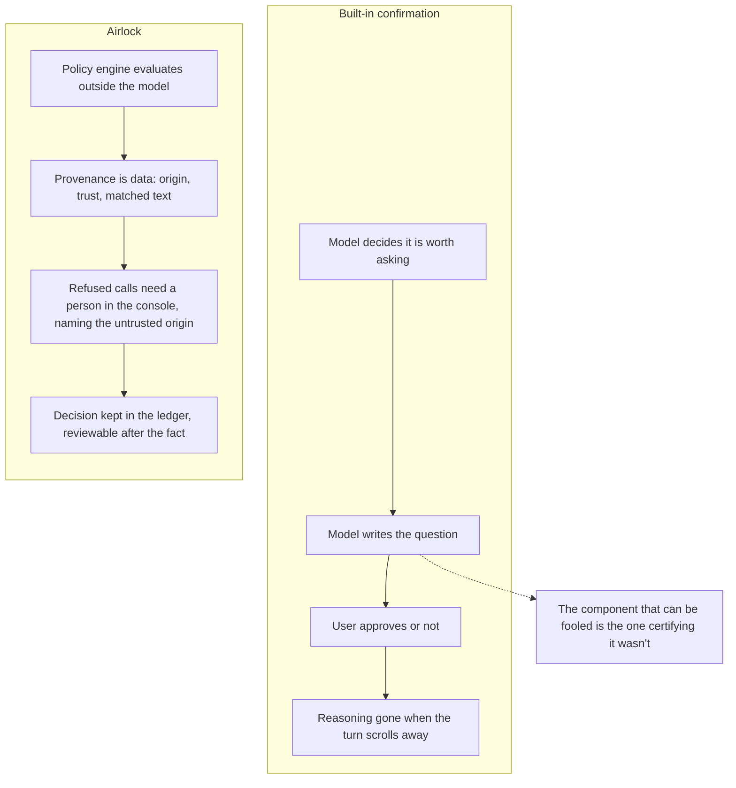

# Diagram sources

Mermaid, so GitHub renders them inline and Excalidraw can import the same source
(**Excalidraw → menu → Import → Mermaid**). Keep these and the README in step: if
one changes, change both.

Two things learned importing these into Excalidraw, both worth keeping:

**Labels are single-line.** Excalidraw's importer drops ` ` rather than
breaking on it, so multi-line labels arrive as one run-on sentence. Write them
short instead of relying on line breaks.

**Edge labels stay to one to three words.** The importer seats a label by cutting
the line in half around it, so a long caption leaves an arrow that reads as
broken — or worse, as though the caption itself were a node. Detail belongs in
the node text, where it costs nothing.

**Nothing that did not happen gets an arrow.** A dotted line into dispatch
labelled "never sent" still draws an arrowhead arriving there, which is the
opposite of what it means — the whole point is that dispatch never hears about
the call. A note on that lane says it without drawing it.

**Notes and replies at the same step collide.** Mermaid places a note and the
reply that follows it at nearly the same height, and Excalidraw does not nudge
them apart. Put the note before the reply and keep both short.

**A refused path must not point at its destination.** An arrow into `dispatch`
labelled "refused" still draws an arrowhead arriving there, which says the
opposite of what it means. The refusal terminates in its own node instead, so
nothing in the picture shows the write landing.

---

## 1. Architecture and the trust boundary

The one a judge should see first. Origins, who publishes what, and the single
place a call can be refused.

## 2. The attack, call by call

What the scenario button runs, and where policy intervenes.

## 3. Why a confirmation dialog is not the same thing

The argument the entry has to win, as a diagram.

